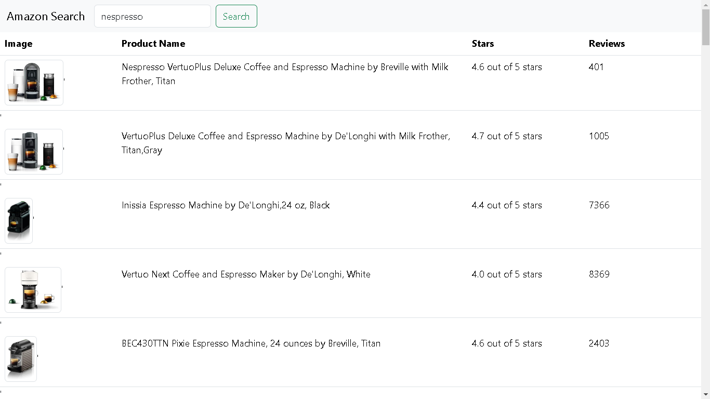
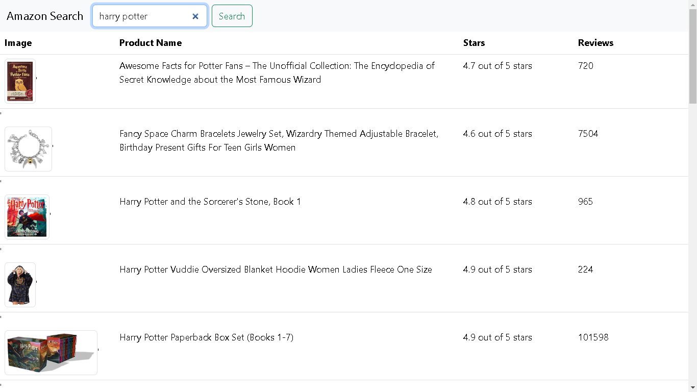

# Simple Web Scrapper to amazon.com

Code challenge for the application to a Full Stack Developer Internship
at Carvalho Aleixo Inc. 

Back-end Stack

- Node.js
- Axios
- Cheerio
- Express, Cors, BodyParser

Front-end Stack

- Html, Css
- Bootstrap
- Javascript

Running Intructions:

- developing environment: npm 10.2.0, node 20.9.0, Chrome Browser
- after downloading the project files run 'npm install' in the command line to install all the projects dependencies
- in the command line run 'node requestData.js' to run the back-end service, it will start the express server on port 3000
- Open the index.html file with your Browser
- try to search for "nespresso" or "harry potter" to test the scraper

Images: 
"Nespresso" search  
 
"Harry Potter" search  
 
